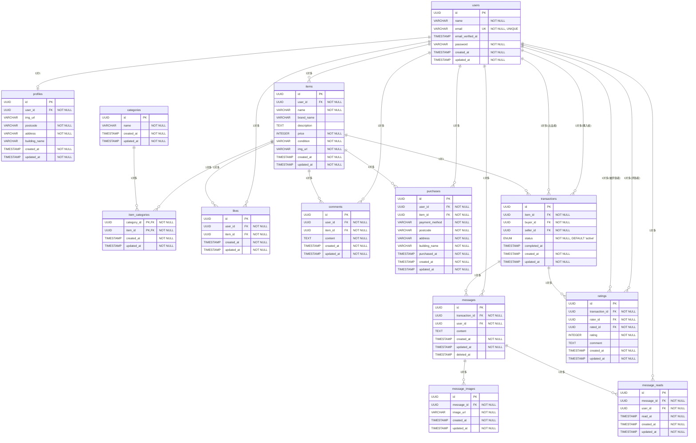

# coachtech フリマ

## プロジェクトの概要

coachtech フリマは、Laravel で構築されたフリーマーケットアプリケーションです。ユーザーが商品を出品・購入・閲覧できるプラットフォームを提供します。

### 主な機能

- **ユーザー認証・管理**

  - 新規会員登録・ログイン・ログアウト
  - メール認証機能
  - プロフィール編集・住所管理

- **商品関連機能**

  - 商品出品
  - 商品検索・カテゴリー別表示
  - 商品詳細表示・画像アップロード
  - お気に入り機能・コメント機能
  - マイリスト機能（お気に入り商品一覧）
  - 出品商品一覧・購入商品一覧

- **購入・決済機能**

  - 商品購入機能
  - Stripe 決済連携
  - 配送先住所変更

- **取引管理機能**

  - 取引チャット画面の表示
  - 取引完了機能

- **メッセージ機能（チャット機能）**

  - メッセージ送信・更新・削除
  - 画像添付機能
  - 既読管理機能

- **評価機能**

  - 取引完了後の評価（1-5 段階）
  - 評価コメント機能

- **その他**
  - レスポンシブデザイン対応
  - バリデーション機能
  - ファイルアップロード機能
  - CI/CD (GitHub Actions)

## 使用技術

### バックエンド

- **PHP** 7.3|8.0
- **Laravel** 8.x
- **MySQL** 8.0.26

### フロントエンド

- **HTML5/CSS3**
- **JavaScript**
- **Blade テンプレートエンジン**

### 認証・決済

- **Laravel Fortify** (認証機能)
- **Laravel Cashier** (Stripe 決済)

### 開発・運用環境

- **Docker** & **Docker Compose**
- **Nginx** 1.21.1
- **PHPMyAdmin** (データベース管理)
- **MailHog** (メール送信テスト)

### 開発ツール

- **PHPStan** (静的解析)
- **PHP CodeSniffer** (コード規約チェック)
- **PHP CS Fixer** (コード整形)
- **PHPUnit** (テスト)

## データベース設計

### ER 図



### テーブル説明

#### 1. users（ユーザー）

- システムのユーザー情報を管理
- UUID を主キーとして使用

#### 2. profiles（プロフィール）

- ユーザーのプロフィール情報（住所など）を管理
- ユーザーと 1 対 1 の関係

#### 3. categories（カテゴリー）

- 商品カテゴリー情報を管理

#### 4. items（商品）

- 出品商品の情報を管理
- 出品者（user_id）と関連

#### 5. item_categories（商品カテゴリー）

- 商品とカテゴリーの多対多関係を管理する中間テーブル

#### 6. likes（お気に入り）

- ユーザーが商品をお気に入り登録した情報を管理

#### 7. comments（コメント）

- 商品に対するコメントを管理

#### 8. purchases（購入履歴）

- 商品の購入履歴を管理
- 決済方法や配送先住所を含む

#### 9. transactions（取引）

- 商品の取引情報を管理
- 購入者（buyer_id）と出品者（seller_id）の両方で users テーブルと関連
- ステータス（active, completed）で取引状態を管理

#### 10. messages（メッセージ）

- 取引中のメッセージを管理
- ソフトデリートに対応

#### 11. message_images（メッセージ画像）

- メッセージに添付された画像を管理

#### 12. message_reads（メッセージ既読）

- メッセージの既読情報を管理
- 同じメッセージを同じユーザーが複数回既読にすることを防ぐ制約あり

#### 13. ratings（評価）

- 取引完了後の評価を管理
- 評価者（rater_id）と被評価者（rated_id）の両方で users テーブルと関連
- 同じ取引で同じ人が複数回評価することを防ぐ制約あり

### リレーションシップ

1. **users → profiles**: 1 対 1（1 人のユーザーは 1 つのプロフィールを持つ）
2. **users → items**: 1 対多（1 人のユーザーは複数の商品を出品できる）
3. **users → likes**: 1 対多（1 人のユーザーは複数の商品をお気に入り登録できる）
4. **users → comments**: 1 対多（1 人のユーザーは複数のコメントを投稿できる）
5. **users → purchases**: 1 対多（1 人のユーザーは複数の商品を購入できる）
6. **users → transactions**: 1 対多（購入者として、出品者として）
7. **users → messages**: 1 対多（1 人のユーザーは複数のメッセージを送信できる）
8. **users → message_reads**: 1 対多（1 人のユーザーは複数のメッセージを既読にできる）
9. **users → ratings**: 1 対多（評価者として、被評価者として）
10. **items → item_categories**: 1 対多（1 つの商品は複数のカテゴリーに属せる）
11. **categories → item_categories**: 1 対多（1 つのカテゴリーは複数の商品に属せる）
12. **items → likes**: 1 対多（1 つの商品は複数のユーザーにお気に入り登録される）
13. **items → comments**: 1 対多（1 つの商品は複数のコメントを持つ）
14. **items → purchases**: 1 対多（1 つの商品は複数の購入履歴を持つ）
15. **items → transactions**: 1 対 1（1 つの商品は 1 つの取引を持つ）
16. **transactions → messages**: 1 対多（1 つの取引は複数のメッセージを持つ）
17. **transactions → ratings**: 1 対多（1 つの取引は複数の評価を持つ）
18. **messages → message_images**: 1 対多（1 つのメッセージは複数の画像を持つ）
19. **messages → message_reads**: 1 対多（1 つのメッセージは複数の既読情報を持つ）

### ENUM 値

#### transactions.status

- `active`: 取引中
- `completed`: 取引完了

### テーブル仕様書

#### 1. users テーブル（ユーザー）

| カラム名          | データ型     | 制約             | 説明                     |
| ----------------- | ------------ | ---------------- | ------------------------ |
| id                | UUID         | PRIMARY KEY      | ユーザー ID              |
| name              | VARCHAR(255) | NOT NULL         | ユーザー名               |
| email             | VARCHAR(255) | NOT NULL, UNIQUE | メールアドレス           |
| email_verified_at | TIMESTAMP    | NULL             | メール認証日時           |
| password          | VARCHAR(255) | NOT NULL         | パスワード（ハッシュ化） |
| remember_token    | VARCHAR(100) | NULL             | ログイン保持トークン     |
| created_at        | TIMESTAMP    | NOT NULL         | 作成日時                 |
| updated_at        | TIMESTAMP    | NOT NULL         | 更新日時                 |

**インデックス:**

- PRIMARY KEY (id)
- UNIQUE INDEX (email)

#### 2. profiles テーブル（プロフィール）

| カラム名      | データ型     | 制約                  | 説明                 |
| ------------- | ------------ | --------------------- | -------------------- |
| id            | UUID         | PRIMARY KEY           | プロフィール ID      |
| user_id       | UUID         | NOT NULL, FOREIGN KEY | ユーザー ID          |
| img_url       | VARCHAR(255) | NULL                  | プロフィール画像 URL |
| postcode      | VARCHAR(255) | NOT NULL              | 郵便番号             |
| address       | VARCHAR(255) | NOT NULL              | 住所                 |
| building_name | VARCHAR(255) | NULL                  | 建物名               |
| created_at    | TIMESTAMP    | NOT NULL              | 作成日時             |
| updated_at    | TIMESTAMP    | NOT NULL              | 更新日時             |

**インデックス:**

- PRIMARY KEY (id)
- FOREIGN KEY (user_id) REFERENCES users(id) ON DELETE CASCADE

#### 3. categories テーブル（カテゴリー）

| カラム名   | データ型     | 制約        | 説明          |
| ---------- | ------------ | ----------- | ------------- |
| id         | UUID         | PRIMARY KEY | カテゴリー ID |
| name       | VARCHAR(255) | NOT NULL    | カテゴリー名  |
| created_at | TIMESTAMP    | NOT NULL    | 作成日時      |
| updated_at | TIMESTAMP    | NOT NULL    | 更新日時      |

**インデックス:**

- PRIMARY KEY (id)

#### 4. items テーブル（商品）

| カラム名    | データ型     | 制約                  | 説明         |
| ----------- | ------------ | --------------------- | ------------ |
| id          | UUID         | PRIMARY KEY           | 商品 ID      |
| user_id     | UUID         | NOT NULL, FOREIGN KEY | 出品者 ID    |
| name        | VARCHAR(255) | NOT NULL              | 商品名       |
| brand_name  | VARCHAR(255) | NULL                  | ブランド名   |
| description | TEXT         | NULL                  | 商品説明     |
| price       | INTEGER      | NOT NULL              | 価格         |
| condition   | VARCHAR(255) | NOT NULL              | 商品状態     |
| img_url     | VARCHAR(255) | NOT NULL              | 商品画像 URL |
| created_at  | TIMESTAMP    | NOT NULL              | 作成日時     |
| updated_at  | TIMESTAMP    | NOT NULL              | 更新日時     |

**インデックス:**

- PRIMARY KEY (id)
- FOREIGN KEY (user_id) REFERENCES users(id) ON DELETE CASCADE

#### 5. item_categories テーブル（商品カテゴリー）

| カラム名    | データ型  | 制約                     | 説明          |
| ----------- | --------- | ------------------------ | ------------- |
| category_id | UUID      | PRIMARY KEY, FOREIGN KEY | カテゴリー ID |
| item_id     | UUID      | PRIMARY KEY, FOREIGN KEY | 商品 ID       |
| created_at  | TIMESTAMP | NOT NULL                 | 作成日時      |
| updated_at  | TIMESTAMP | NOT NULL                 | 更新日時      |

**インデックス:**

- PRIMARY KEY (category_id, item_id)
- FOREIGN KEY (category_id) REFERENCES categories(id) ON DELETE CASCADE
- FOREIGN KEY (item_id) REFERENCES items(id) ON DELETE CASCADE
- INDEX (category_id)
- INDEX (item_id)

#### 6. likes テーブル（お気に入り）

| カラム名   | データ型  | 制約                  | 説明          |
| ---------- | --------- | --------------------- | ------------- |
| id         | UUID      | PRIMARY KEY           | お気に入り ID |
| user_id    | UUID      | NOT NULL, FOREIGN KEY | ユーザー ID   |
| item_id    | UUID      | NOT NULL, FOREIGN KEY | 商品 ID       |
| created_at | TIMESTAMP | NOT NULL              | 作成日時      |
| updated_at | TIMESTAMP | NOT NULL              | 更新日時      |

**インデックス:**

- PRIMARY KEY (id)
- FOREIGN KEY (user_id) REFERENCES users(id) ON DELETE CASCADE
- FOREIGN KEY (item_id) REFERENCES items(id) ON DELETE CASCADE

#### 7. comments テーブル（コメント）

| カラム名   | データ型  | 制約                  | 説明         |
| ---------- | --------- | --------------------- | ------------ |
| id         | UUID      | PRIMARY KEY           | コメント ID  |
| user_id    | UUID      | NOT NULL, FOREIGN KEY | ユーザー ID  |
| item_id    | UUID      | NOT NULL, FOREIGN KEY | 商品 ID      |
| content    | TEXT      | NOT NULL              | コメント内容 |
| created_at | TIMESTAMP | NOT NULL              | 作成日時     |
| updated_at | TIMESTAMP | NOT NULL              | 更新日時     |

**インデックス:**

- PRIMARY KEY (id)
- FOREIGN KEY (user_id) REFERENCES users(id) ON DELETE CASCADE
- FOREIGN KEY (item_id) REFERENCES items(id) ON DELETE CASCADE

#### 8. purchases テーブル（購入履歴）

| カラム名       | データ型     | 制約                  | 説明        |
| -------------- | ------------ | --------------------- | ----------- |
| id             | UUID         | PRIMARY KEY           | 購入履歴 ID |
| user_id        | UUID         | NOT NULL, FOREIGN KEY | 購入者 ID   |
| item_id        | UUID         | NOT NULL, FOREIGN KEY | 商品 ID     |
| payment_method | VARCHAR(255) | NOT NULL              | 決済方法    |
| postcode       | VARCHAR(255) | NOT NULL              | 郵便番号    |
| address        | VARCHAR(255) | NOT NULL              | 住所        |
| building_name  | VARCHAR(255) | NOT NULL              | 建物名      |
| purchased_at   | TIMESTAMP    | NOT NULL              | 購入日時    |
| created_at     | TIMESTAMP    | NOT NULL              | 作成日時    |
| updated_at     | TIMESTAMP    | NOT NULL              | 更新日時    |

**インデックス:**

- PRIMARY KEY (id)
- FOREIGN KEY (user_id) REFERENCES users(id) ON DELETE CASCADE
- FOREIGN KEY (item_id) REFERENCES items(id) ON DELETE CASCADE

#### 9. transactions テーブル（取引）

| カラム名     | データ型  | 制約                       | 説明      |
| ------------ | --------- | -------------------------- | --------- |
| id           | UUID      | PRIMARY KEY                | 取引 ID   |
| item_id      | UUID      | NOT NULL, FOREIGN KEY      | 商品 ID   |
| buyer_id     | UUID      | NOT NULL, FOREIGN KEY      | 購入者 ID |
| seller_id    | UUID      | NOT NULL, FOREIGN KEY      | 出品者 ID |
| status       | ENUM      | NOT NULL, DEFAULT 'active' | 取引状態  |
| completed_at | TIMESTAMP | NULL                       | 完了日時  |
| created_at   | TIMESTAMP | NOT NULL                   | 作成日時  |
| updated_at   | TIMESTAMP | NOT NULL                   | 更新日時  |

**ENUM 値 (status):**

- active: 取引中
- completed: 取引完了

**インデックス:**

- PRIMARY KEY (id)
- FOREIGN KEY (item_id) REFERENCES items(id) ON DELETE CASCADE
- FOREIGN KEY (buyer_id) REFERENCES users(id) ON DELETE CASCADE
- FOREIGN KEY (seller_id) REFERENCES users(id) ON DELETE CASCADE

#### 10. messages テーブル（メッセージ）

| カラム名       | データ型  | 制約                  | 説明                       |
| -------------- | --------- | --------------------- | -------------------------- |
| id             | UUID      | PRIMARY KEY           | メッセージ ID              |
| transaction_id | UUID      | NOT NULL, FOREIGN KEY | 取引 ID                    |
| user_id        | UUID      | NOT NULL, FOREIGN KEY | 送信者 ID                  |
| content        | TEXT      | NULL                  | メッセージ内容             |
| created_at     | TIMESTAMP | NOT NULL              | 作成日時                   |
| updated_at     | TIMESTAMP | NOT NULL              | 更新日時                   |
| deleted_at     | TIMESTAMP | NULL                  | 削除日時（ソフトデリート） |

**インデックス:**

- PRIMARY KEY (id)
- FOREIGN KEY (transaction_id) REFERENCES transactions(id) ON DELETE CASCADE
- FOREIGN KEY (user_id) REFERENCES users(id) ON DELETE CASCADE

#### 11. message_images テーブル（メッセージ画像）

| カラム名   | データ型     | 制約                  | 説明              |
| ---------- | ------------ | --------------------- | ----------------- |
| id         | UUID         | PRIMARY KEY           | メッセージ画像 ID |
| message_id | UUID         | NOT NULL, FOREIGN KEY | メッセージ ID     |
| image_url  | VARCHAR(255) | NOT NULL              | 画像 URL          |
| created_at | TIMESTAMP    | NOT NULL              | 作成日時          |
| updated_at | TIMESTAMP    | NOT NULL              | 更新日時          |

**インデックス:**

- PRIMARY KEY (id)
- FOREIGN KEY (message_id) REFERENCES messages(id) ON DELETE CASCADE

#### 12. message_reads テーブル（メッセージ既読）

| カラム名   | データ型  | 制約                  | 説明          |
| ---------- | --------- | --------------------- | ------------- |
| id         | UUID      | PRIMARY KEY           | 既読 ID       |
| message_id | UUID      | NOT NULL, FOREIGN KEY | メッセージ ID |
| user_id    | UUID      | NOT NULL, FOREIGN KEY | ユーザー ID   |
| read_at    | TIMESTAMP | NOT NULL              | 既読日時      |
| created_at | TIMESTAMP | NOT NULL              | 作成日時      |
| updated_at | TIMESTAMP | NOT NULL              | 更新日時      |

**インデックス:**

- PRIMARY KEY (id)
- FOREIGN KEY (message_id) REFERENCES messages(id) ON DELETE CASCADE
- FOREIGN KEY (user_id) REFERENCES users(id) ON DELETE CASCADE
- UNIQUE INDEX (message_id, user_id)

#### 13. ratings テーブル（評価）

| カラム名       | データ型  | 制約                  | 説明         |
| -------------- | --------- | --------------------- | ------------ |
| id             | UUID      | PRIMARY KEY           | 評価 ID      |
| transaction_id | UUID      | NOT NULL, FOREIGN KEY | 取引 ID      |
| rater_id       | UUID      | NOT NULL, FOREIGN KEY | 評価者 ID    |
| rated_id       | UUID      | NOT NULL, FOREIGN KEY | 被評価者 ID  |
| rating         | INTEGER   | NOT NULL              | 評価（1-5）  |
| comment        | TEXT      | NULL                  | 評価コメント |
| created_at     | TIMESTAMP | NOT NULL              | 作成日時     |
| updated_at     | TIMESTAMP | NOT NULL              | 更新日時     |

**インデックス:**

- PRIMARY KEY (id)
- FOREIGN KEY (transaction_id) REFERENCES transactions(id) ON DELETE CASCADE
- FOREIGN KEY (rater_id) REFERENCES users(id) ON DELETE CASCADE
- FOREIGN KEY (rated_id) REFERENCES users(id) ON DELETE CASCADE
- UNIQUE INDEX (transaction_id, rater_id)

### データ制約・業務ルール

#### items テーブル

- price は正の整数である必要がある

#### transactions テーブル

- buyer_id と seller_id は異なるユーザーである必要がある
- status が completed の場合、completed_at は必須

#### ratings テーブル

- rating は 1 から 5 の範囲である必要がある
- 同じ取引で同じ人が複数回評価することを防ぐ（UNIQUE 制約）

#### message_reads テーブル

- 同じメッセージを同じユーザーが複数回既読にすることを防ぐ（UNIQUE 制約）

## 環境構築手順

### 前提条件

以下のソフトウェアがインストールされていることを確認してください：

- Docker Desktop
- Docker Compose

### 1. リポジトリのクローン

```bash
# SSHでクローンする場合
git clone git@github.com:hasedai0000/furima-app.git

# HTTPSでクローンする場合
git clone https://github.com/hasedai0000/furima-app.git

cd furima-app
```

### 2. 環境の起動

```bash
# Dockerコンテナをビルドして起動
docker compose up -d --build
```

### 3. Laravel アプリケーションのセットアップ

```bash
# PHPコンテナに入る
docker compose exec php bash

# 依存関係のインストール
composer install

# 環境設定ファイルのコピー
cp .env.example .env

# アプリケーションキーの生成
php artisan key:generate

# 画像保存のためシンボリックリンクを作成する
php artisan storage:link

# データベースマイグレーションとシーダーの実行
php artisan migrate:fresh --seed

```

#### 3.1 データベース接続情報

```bash

# .envにDB接続情報の設定
DB_DATABASE=laravel_db
DB_USERNAME=laravel_user
DB_PASSWORD=laravel_pass
DB_HOST=mysql #（コンテナ間通信）

# データベースマイグレーションとシーダーの実行
php artisan migrate:fresh --seed

```

### 4. 動作確認

ブラウザで以下の URL にアクセスして、アプリケーションが正常に動作することを確認してください：

- **アプリケーション**: http://localhost
- **PHPMyAdmin**: http://localhost:8080
- **MailHog**: http://localhost:8025

### 5. 2 回目以降の起動

```bash
docker compose up -d
```

## ログイン情報

### テストユーザー（一般ユーザー）

以下のアカウントでログインできます：

| ユーザー名     | メールアドレス        | パスワード | 状態     |
| -------------- | --------------------- | ---------- | -------- |
| テストユーザー | test@example.com      | password   | 認証済み |
| 田中太郎       | tanaka@example.com    | password   | 認証済み |
| 佐藤花子       | sato@example.com      | password   | 認証済み |
| 鈴木美咲       | suzuki@example.com    | password   | 認証済み |
| 高橋健太       | takahashi@example.com | password   | 認証済み |

### メール未認証ユーザー

| ユーザー名 | メールアドレス     | パスワード | 状態   |
| ---------- | ------------------ | ---------- | ------ |
| 山田次郎   | yamada@example.com | password   | 未認証 |
| 伊藤愛     | ito@example.com    | password   | 未認証 |

## Stripe の設定

### API キーの設定

- **STRIPE_KEY**: 自身の公開可能キー
- **STRIPE_SECRET**: 自身のシークレットキー

### 決済時のカード情報

- **カード番号**: 4242 4242 4242 4242
- **有効期限**: 04/31（現在より未来なら可）
- **セキュリティコード**: 424（3 桁ならなんでも可）
- **氏名**: 任意

## 開発時の操作

### コンテナの操作

```bash
# コンテナを停止
docker compose stop

# コンテナを停止して削除
docker compose down

# コンテナを再起動
docker compose restart
```

### ログの確認

```bash
# 全サービスのログを確認
docker compose logs

# 特定のサービスのログを確認
docker compose logs nginx
docker compose logs php
docker compose logs mysql
```

### コンテナ内での作業

```bash
# PHPコンテナに入る
docker compose exec php bash

# Nginxコンテナに入る
docker compose exec nginx bash

# MySQLコンテナに入る
docker compose exec mysql bash
```

### MySQL への直接アクセス

```bash
# MySQLコンテナ内でMySQLにログイン
docker compose exec mysql mysql -u laravel_user -p laravel_db
# パスワード: laravel_pass
```

### 開発用コマンド

```bash
# PHPコンテナ内で実行

# マイグレーションの実行
php artisan migrate

# シーダーの実行
php artisan db:seed

# テスト用のDBを作成
docker compose exec mysql mysql -u root -proot -e "CREATE DATABASE IF NOT EXISTS furima_test;"

# マイグレーション
docker compose exec php php artisan migrate --env=testing

# テストを実行
docker compose exec php php artisan test
```

## CI/CD

このプロジェクトでは GitHub Actions を使用して CI/CD パイプラインを構築しています。

### 自動テスト

プッシュ・プルリクエスト時に以下が自動実行されます：

- **テスト実行**: PHPUnit を使用したユニットテスト・フィーチャーテスト

### マトリックステスト

複数の PHP バージョンでテストを実行：

- PHP 8.0

### ワークフロー

CI 設定ファイル: `.github/workflows/ci.yml`

```bash
# ローカルで同じテストを実行する場合
cd src
composer test      # PHPUnit テストを実行
```

## ファイル構成

```
Furima/
├── docker/                 # Docker設定
│   ├── nginx/
│   │   └── default.conf    # Nginx設定
│   ├── php/
│   │   ├── Dockerfile      # PHP設定
│   │   └── php.ini         # PHP設定
│   └── mysql/
│       └── my.cnf          # MySQL設定
├── src/                    # Laravelアプリケーション
│   ├── app/                # アプリケーションロジック
│   ├── database/           # マイグレーション・シーダー
│   ├── public/             # 公開ファイル
│   ├── resources/          # ビュー・CSS・JS
│   └── routes/             # ルート定義
├── docker-compose.yml      # Docker Compose設定
└── README.md              # このファイル
```

## トラブルシューティング

### ポート競合の場合

ポート 80 が使用中の場合、`docker-compose.yml`を編集：

```yaml
services:
  nginx:
    ports:
      - "8080:80" # ホストの8080ポートを使用
```

アクセス URL: http://localhost:8080

### コンテナが起動しない場合

```bash
# コンテナの状態確認
docker compose ps

# ログでエラー確認
docker compose logs

# 完全にクリーンアップして再構築
docker compose down --volumes --remove-orphans
docker compose up --build
```

### データベース接続エラー

```bash
# PHPコンテナ内で接続確認
docker compose exec php php artisan tinker
DB::connection()->getPdo();
```
